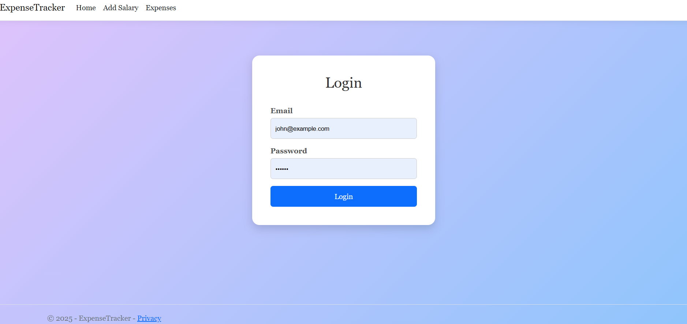
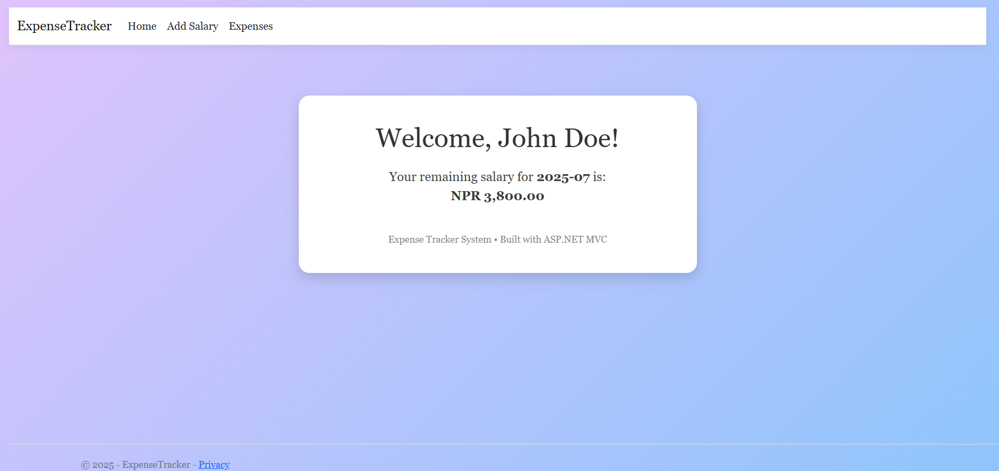
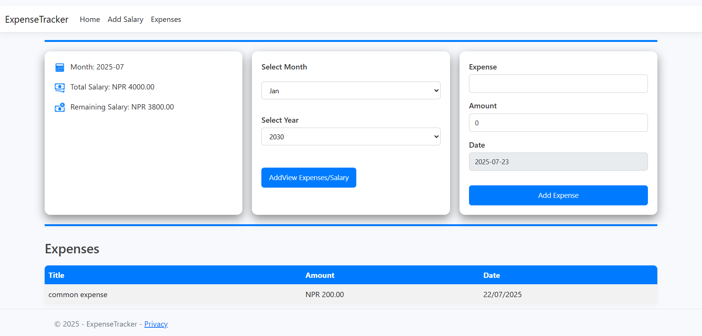
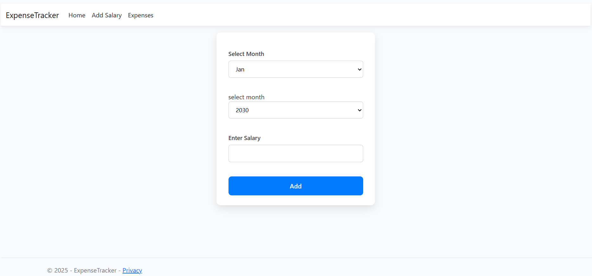

# Expense Tracker with ASP.NET MVC

This is a asp.net mvc project which is stil in developement.

## Features that are added currently

- add salary for month
- add expenses for the month
- view expenses of month

## Tech Stack

**Client:** ASP.NET MVC RAZOR VIEW, CSS

**Server:** ASP.NET 9 MVC, MYSQL, DAPPER

# Expense Tracker Project

This project is an Expense Tracker web application built with ASP.NET MVC.

## Features
- User Login
- Homepage with salary summary
- Expense tracking and management
- Add new salary and expenses

---

## NOTE

THIS PROJECT IS STILL IN DEVELOPMENT SO MORE FEATURES WILL BE ADDED SOON

---

## Screenshots

### Login Page

---

### Homepage

---

### Expense Page

---

### Add Salary Page

---
## License

[MIT](https://choosealicense.com/licenses/mit/)

